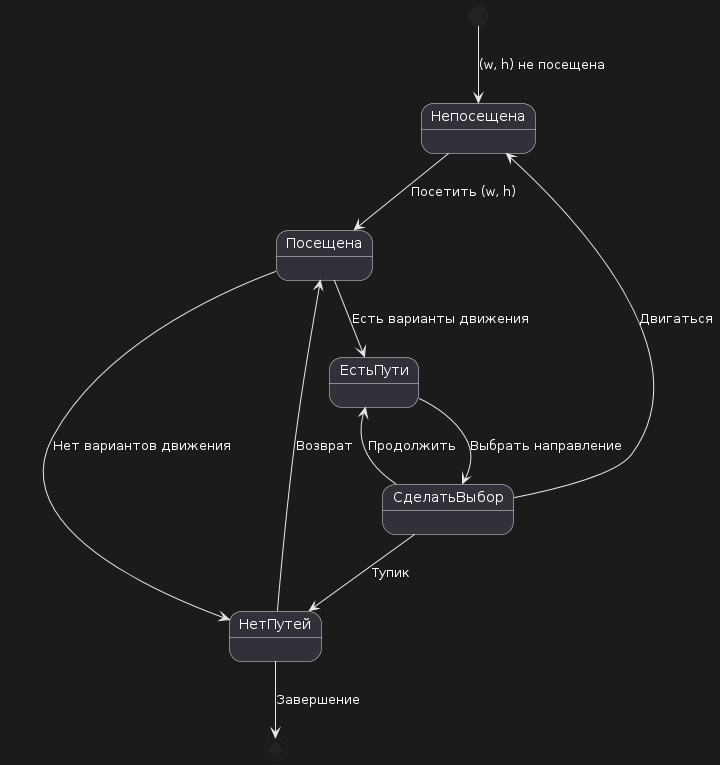
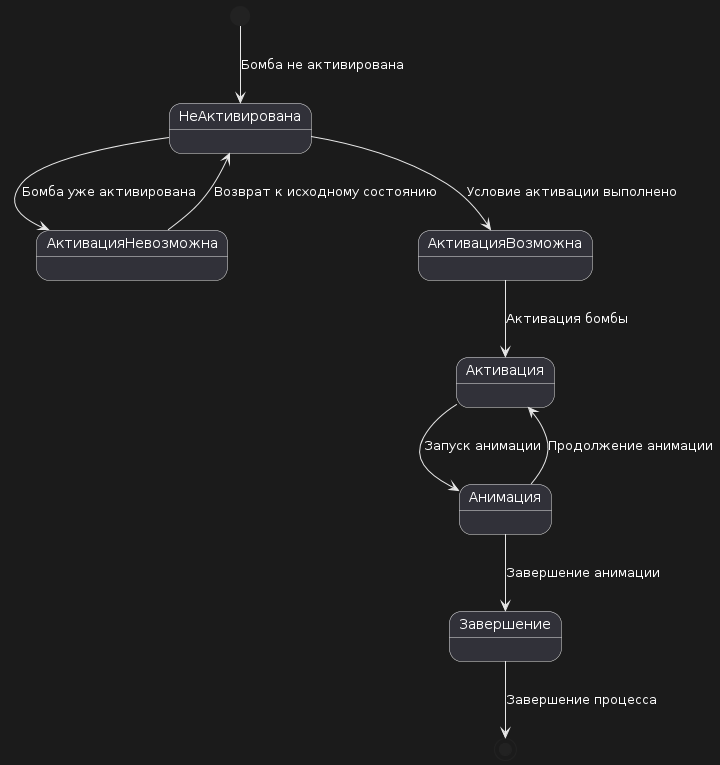
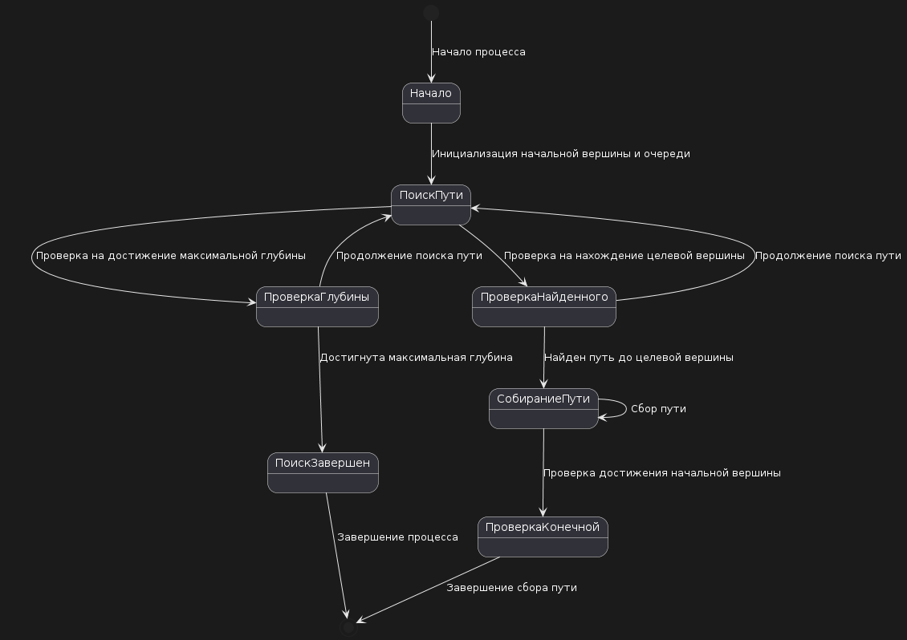
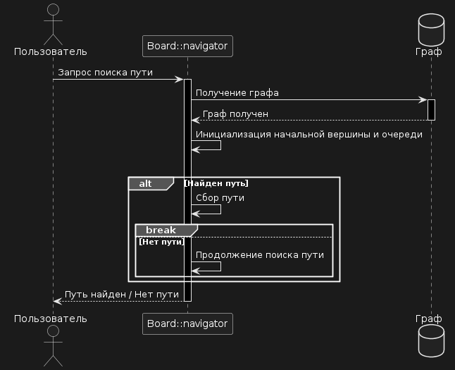

# Поведенческие модели

## **Алгоритм построения лабиринта (DFS)**

Этот алгоритм использует метод поиска в глубину (DFS) для генерации лабиринта. Вот его шаги:

1. **Начало**: Алгоритм начинает с начальной ячейки лабиринта.

2. **Выбор направления**: Для текущей ячейки алгоритм проверяет все соседние ячейки, чтобы определить, в какие из них можно продвинуться.

3. **Продвижение**: Если есть доступные соседние ячейки, алгоритм выбирает одну из них случайным образом и перемещается в нее. Он также убирает стенку между текущей и выбранной ячейками.

4. **Рекурсия**: Алгоритм рекурсивно повторяет процесс для новой текущей ячейки. Это позволяет ему продолжать генерацию лабиринта, пока есть доступные пути.

5. **Завершение**: Алгоритм завершает работу, когда больше нет доступных путей для продвижения.

В результате выполнения этого алгоритма получается лабиринт с проходами и стенами, который представляет собой граф, где каждая ячейка соединена с соседними ячейками через проходы без циклов.

- диаграмма состояний

 * [оффлай файл](./diagram_text/build_board_state_diag.puml)   
  

## **Алгоритм установки бомбы**

Этот алгоритм описывает процесс установки бомбы в игровом мире. Вот его шаги:

1. **Проверка активации**: Алгоритм начинает с проверки, активирована ли уже бомба. Если да, то установка новой бомбы не требуется, и алгоритм завершает работу.

2. **Определение положения**: Определяется текущее положение игрового объекта, в котором будет размещена бомба.

3. **Проверка перемещения**: Сравнивается текущее положение бомбы с предыдущим. Если они совпадают, значит, бомба не перемещалась.
    - Если бомба не перемещалась, проверяется, прошло ли достаточно времени для установки бомбы.
        - Если прошло достаточно времени, бомба активируется, и начинается анимация ее установки.
        - В противном случае отображается продолжительность установки.

4. **Перемещение бомбы**: Если бомба перемещалась, обновляется время начала установки и ее положение.

5. **Завершение установки**: Алгоритм завершает работу после установки бомбы или если необходимо продолжить установку в следующем кадре.

В результате выполнения этого алгоритма бомба устанавливается в игровом мире, и, при наступлении определенного времени, активируется.

- диаграмма состояний

 * [оффлай файл](./diagram_text/bomb_state_diag.puml)   
  

## **Алгоритм навигации в лабиринте**

Этот алгоритм реализует процесс поиска пути в лабиринте от одной точки до другой. Вот его основные шаги:

1. **Инициализация**: Алгоритм начинает с инициализации начальной ячейки и добавляет ее в очередь для дальнейшей обработки.

2. **Поиск пути**: Алгоритм продолжает обработку ячеек из очереди до тех пор, пока не найдет путь к целевой ячейке или пока не достигнет максимальной глубины поиска.

3. **Проверка доступных путей**: Для каждой обрабатываемой ячейки алгоритм проверяет все доступные пути, связанные с ней.

4. **Добавление в очередь**: Если найденный путь не приводит к целевой ячейке и не превышает максимальную глубину, алгоритм добавляет соседние ячейки в очередь для дальнейшей обработки.

5. **Построение пути**: Когда целевая ячейка найдена, алгоритм строит путь от нее к начальной ячейке, используя информацию о предыдущих шагах.

6. **Завершение**: Алгоритм завершает свою работу, когда найден путь к целевой ячейке или достигнута максимальная глубина поиска.

Этот алгоритм обеспечивает эффективный поиск пути в лабиринте, используя методы обхода в ширину, в зависимости от конкретной реализации.

- диаграмма состояний

 * [оффлай файл](./diagram_text/navigator_state_diag.puml)   
  

- диаграмма последовательности

 * [оффлай файл](./diagram_text/navigator_posl_diag.puml)   
  