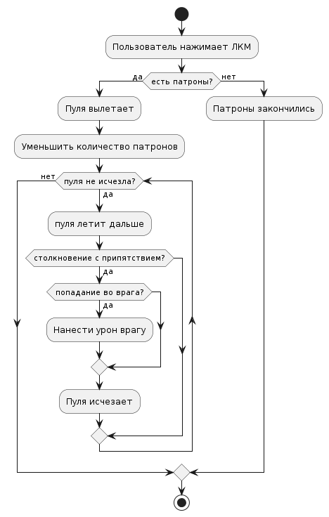
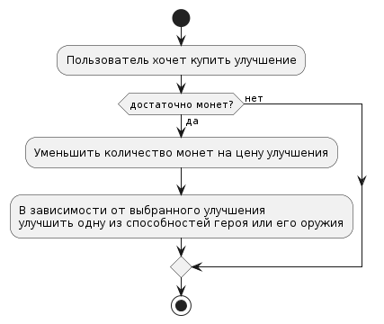
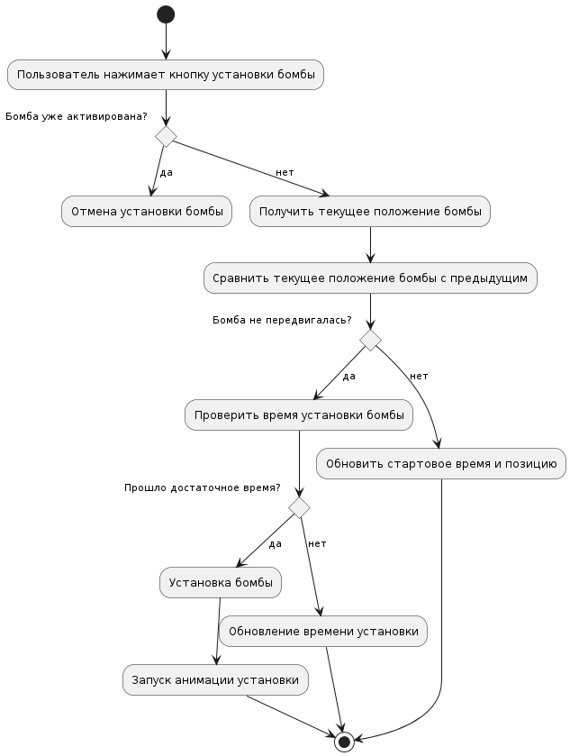
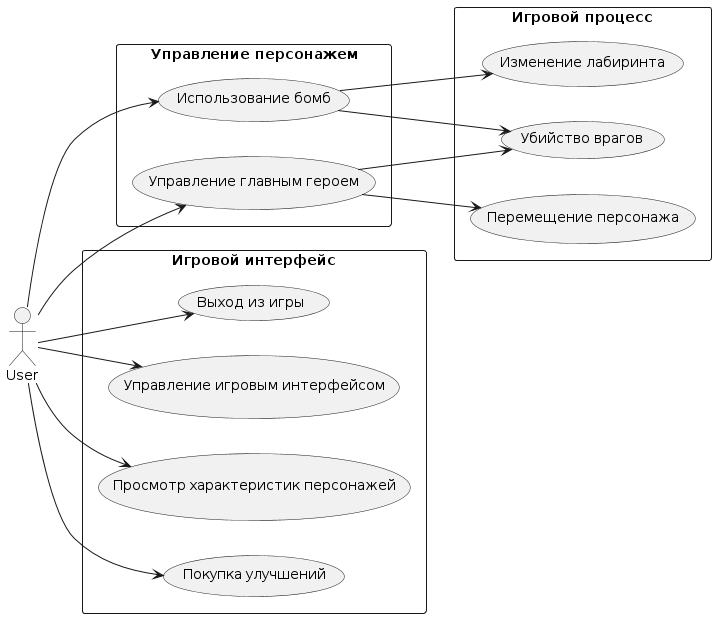

### Управление главным героем:

**Пользователь делает:** Нажимает клавиши WASD для перемещения главного героя.
**Приложение делает:** Отслеживает нажатия клавиш и перемещает главного героя в соответствии с направлением, если это возможно.
**Пользователь:** Наблюдает, как главный герой двигается по лабиринту в выбранном направлении.
**Приложение:** Обновляет положение главного героя на экране.

---

### Стрельба в направлении мыши:

**Пользователь делает:** Наводит указатель мыши в нужном направлении для выстрела и нажимает ЛКМ.
**Приложение делает:** Определяет положение указателя мыши и направление стрельбы главного героя.
**Пользователь:** Наблюдает, как главный герой стреляет в указанном направлении.
**Приложение:** Создает и отображает пулю, летящую в направлении указателя мыши и обрабатывает столкновение пули с другими объектами.

#### Диаграма активности

* [оффлай файл](./diagram_text/fire_activity_diag.puml)

---

### Нападение врагов:

**Пользователь делает:** Продвигается по лабиринту, где могут появляться враги.
**Приложение делает:** Генерирует появление врагов и определяет их поведениев соответсвии с растоянием до главного героя.
**Пользователь:** Сталкивается с врагами и взаимодействует с ними (стреляет, убегает, устанавливает бомбы и т. д.).
**Приложение:** Реагирует на действия пользователя и врагов, определяет их атаки и поведение.

---

### Покупка улучшений:

**Пользователь делает:** Нажимает на кнопки боковой панели для покупки улучшений.
**Приложение делает:** Обрабатывает запросы пользователя и изменяет характеристики главного героя соответствующим образом.
**Пользователь:** Видит изменения в характеристиках главного героя после покупки улучшений.
**Приложение:** Обновляет интерфейс игры и отображает текущие улучшения главного героя.

#### Диаграма активности

* [оффлай файл](./diagram_text/buy_activity_diag.puml)

---

### Использование бомб:

**Пользователь делает:** Устанавливает бомбы с помощью клавиши B и взрывает их с помощью клавиши Пробел.
**Приложение делает:** Обрабатывает команды пользователя и отображает взрывы бомб.
**Пользователь:** Наблюдает за эффектами взрывов и их воздействием на окружающие объекты.
**Приложение:** Уничтожает ближайшие стены и препятствия, а также наносит урон врагам в радиусе взрыва.

#### Диаграма активности

* [оффлай файл](./diagram_text/bomb_activity_diag.puml)

---

### Просмотр характеристик персонажей:

**Пользователь делает:** Наводит указатель мыши на персонажа.
**Приложение делает:** Отображает характеристики персонажа при наведении мыши.
**Пользователь:** Получает информацию о врагах и их характеристиках.
**Приложение:** Отображает анимацию персонажа и его характеристики на экране.

---

### Управление игровым интерфейсом:

**Пользователь делает:** Взаимодействует с кнопками на боковой панели.
**Приложение делает:** Обрабатывает действия пользователя и обновляет игровой интерфейс.
**Пользователь:** Видит изменения в игровом интерфейсе в результате своих действий.
**Приложение:** Отображает обновленный игровой интерфейс с учетом действий пользователя.

---

### Выход из игры:

**Пользователь делает:** Нажимает на кнопку выхода из игры.
**Приложение делает:** Завершает работу и закрывает игровое окно.
**Пользователь:** Выходит из игры и возвращается к рабочему столу или другим делам :)
**Приложение:** Завершает свою работу и освобождает ресурсы.

---

## Диаграмма вариантов испозльзования
* [оффлай файл](./diagram_text/vars_diagram.puml)

---
