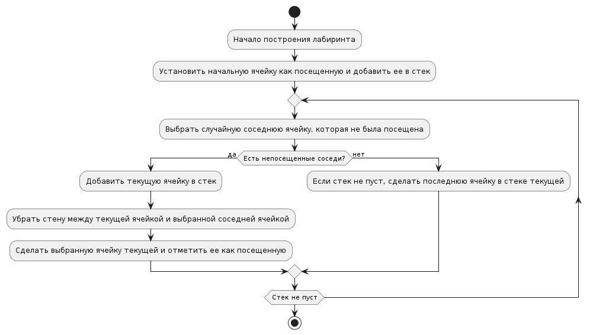

# Управление персонажем

---

## Пользователь управляет персонажем клавишами WASD

### Пользователь нажимает клавиши W, A, S или D
- Приложение обнаруживает нажатие клавиш и перемещает персонажа в соответствующем направлении.

### Приложение обновляет позицию персонажа на экране
- Пользователь видит, как персонаж перемещается в выбранном направлении.

---

## Пользователь может стрелять в направлении мыши

### Пользователь щелкает мышью
- Приложение определяет положение курсора и направляет выстрел персонажа в эту точку.

### Приложение отображает выстрел и перемещает пулю
- Пользователь видит выстрел и движение пули в направлении курсора.

## Диаграмма активности для стрельбы

* [оффлай файл](./diagram_text/fire_activity_diag.puml)   
  

---

# Взаимодействие с окружением

---

## Пользователь запускает новый раунд игры

### Пользователь нажимает кнопку "Новая игра" или начинает новый уровень
- Приложение инициирует начало нового раунда игры.

### Приложение генерирует случайный лабиринт
- Приложение использует алгоритм случайной генерации лабиринта для создания нового игрового поля.

### Приложение отображает сгенерированный лабиринт
- Пользователь видит новое игровое поле с построенным лабиринтом.

## Диаграмма активности для построения лабиринта

* [оффлай файл](./diagram_text/build_board_activity_diag.puml)   
  

---

## Пользователь начинает исследование лабиринта и взаимодействует с окружающей средой

---

## Пользователь может устанавливать бомбы и взрывать их

### Пользователь нажимает клавишу B
- Приложение размещает бомбу в текущем положении персонажа.

### Пользователь нажимает пробел
- Приложение инициирует взрыв бомбы, уничтожая ближайшую стену и нанося урон врагам в радиусе взрыва.

### Приложение отображает взрыв и его последствия
- Пользователь видит эффект взрыва и изменения в окружающей среде.

## Диаграмма активности для установки бомбы

* [оффлай файл](./diagram_text/bomb_acitivity_diag.puml)   

---

## Пользователь может собирать монеты за убийство врагов

### Пользователь уничтожает врага
- Приложение добавляет соответствующее количество монет в инвентарь пользователя.

### Приложение обновляет количество монет в инвентаре
- Пользователь видит, как его богатство увеличивается после уничтожения врагов.

---

# Улучшения и покупки

---

## Пользователь может покупать улучшения на боковой панели

### Пользователь нажимает на кнопки боковой панели
- Приложение отображает доступные для покупки улучшения.

### Пользователь выбирает улучшение и подтверждает покупку
- Приложение списывает сумму счета пользователя и предоставляет выбранное улучшение.

### Приложение обновляет характеристики персонажа
- Пользователь видит изменения в характеристиках своего персонажа после приобретения улучшений.

---

# Просмотр характеристик

---

## Пользователь может просматривать характеристики персонажей и их оружия

### Пользователь наводит курсор на персонажа или его оружие
- Приложение отображает анимацию персонажа в полный рост и его характеристики, а также анимацию оружия и его характеристики.

### Пользователь закрывает окно характеристик
- Приложение скрывает информацию о персонаже и оружии.

---

# Диаграмма вариантов использования

* [оффлай файл](./diagram_text/vars_diagram.puml)   
  