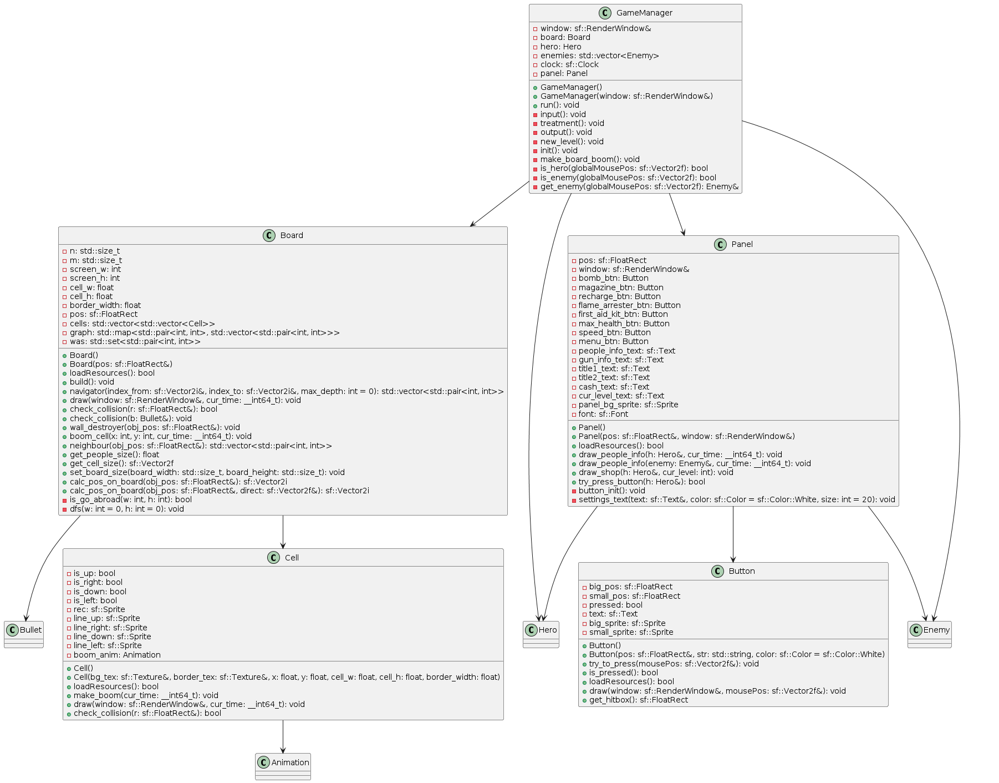
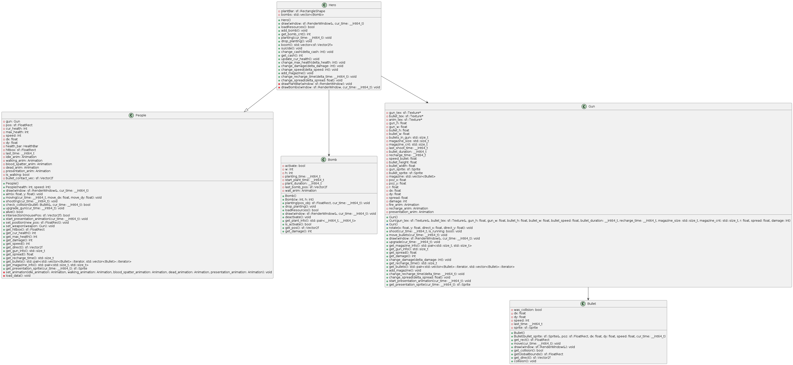
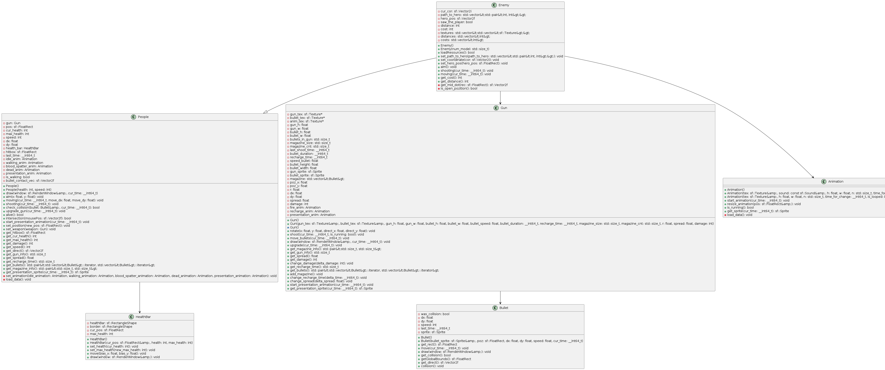
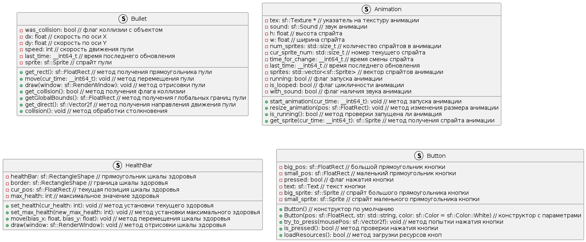

# Диаграмма классов

-  На одной диаграмме все не помещалось, поэтому пршлось поделить на составляющие

## Класс GameManager
 - основной класс игры
* [оффлай файл](./diagram_text/game_manager_class_diag.puml)   

## Класс Hero 
 - предоставляет интерфейс для упрвления главным героем
* [оффлай файл](./diagram_text/hero_class_diag.puml)   
  

## Класс Enemy
 - предоставляет интерфес для обработки поведения врагов  
 * [оффлай файл](./diagram_text/enemy_class_diag.puml)   
  

---

# Диаграммы структур данных

 * [оффлай файл](./diagram_text/structs_diag.puml)   
  

1. **Animation**: Структура для управления анимацией в игре. Включает текстуру, звук, размеры спрайтов, количество спрайтов, время для смены спрайтов, последнее время обновления, вектор спрайтов, состояние анимации и флаг использования звука.

2. **Bomb**: Представляет собой объект бомбы в игре. Включает состояние активации, размеры, время установки, последнее время установки, продолжительность установки, последнюю позицию бомбы и анимацию ожидания.

3. **Bullet**: Описывает снаряды, выпущенные в игре. Содержит информацию о состоянии столкновения, скорости, последнем времени обновления и спрайте.

4. **Button**: Представляет собой кнопку в игровом интерфейсе. Содержит позиции кнопок, флаг нажатия, текст кнопки и соответствующие спрайты.

Эти структуры данных обеспечивают основу для функционирования игрового приложения.

---