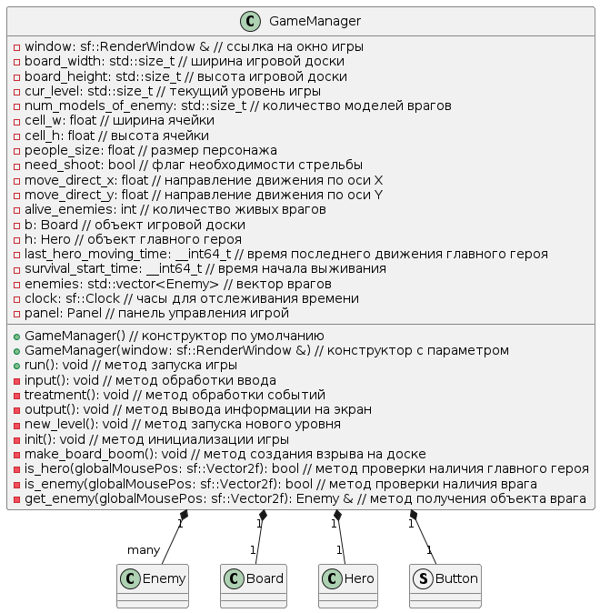

# Диаграмма классов

-  На одной диаграмме все не помещалось, поэтому пршлось поделить на составляющие

## Класс Gun
 - предоставляет интерфес оружия
* [оффлай файл](./diagram_text/gun_class_diag.puml)   

## Класс People
 - предоставляет интерфес для общих характеристик персонажа в игре
* [оффлай файл](./diagram_text/people_class_diag.puml)   

## Классы Hero и Enemy
 - предоставляет интерфейс для удобного управления персонжами
* [оффлай файл](./diagram_text/hero_enemy_class_diag.puml)   
  

## Класс GameManager
 - предоставляет интерфес для запуска игры, является классом оберткой, обеспечивает логику игры
* [оффлай файл](./diagram_text/game_manager_class_diag.puml)   

---

# Диаграммы структур данных

 * [оффлай файл](./diagram_text/structs_diag.puml)   
  

### Структура данных Bullet

Эта структура данных представляет пулю в игре. Она используется для управления движением, отрисовкой и обработкой столкновений пули с объектами на игровом поле. Пуля имеет свойство `was_collision`, которое указывает, произошло ли столкновение с объектом. Также есть свойства для скоростей движения пули по осям `dx` и `dy`, скорость пули `speed`, время последнего обновления `last_time` и спрайт `sprite`, который отображает внешний вид пули.

### Структура данных Animation

Эта структура данных представляет анимацию в игре. Она используется для управления последовательным отображением спрайтов, создавая впечатление анимации. Анимация имеет свойства, такие как текстура `tex`, звук `sound`, размеры спрайта `h` и `w`, количество спрайтов `num_sprites`, текущий номер спрайта `cur_sprite_num`, время смены спрайта `time_for_change`, последнее время обновления `last_time`, вектор спрайтов `sprites`, а также флаги `running`, `is_looped`, `with_sound`, указывающие на состояние анимации.

### Структура данных HealthBar

Эта структура данных представляет шкалу здоровья в игре. Она используется для отображения текущего состояния здоровья персонажа или объекта. Шкала здоровья имеет свойства, такие как прямоугольники `healthBar` и `border`, описывающие внешний вид шкалы и её границ, а также свойства `cur_pos` и `max_health`, описывающие текущую позицию и максимальное значение здоровья.

### Структура данных Button

Эта структура данных представляет кнопку в игре. Она используется для взаимодействия игрока с интерфейсом. Кнопка имеет свойства, такие как прямоугольники `big_pos` и `small_pos`, определяющие размеры кнопки, флаг `pressed`, указывающий, была ли нажата кнопка, текст `text`, отображающий название кнопки, и спрайты `big_sprite` и `small_sprite`, используемые для отрисовки кнопки.

---